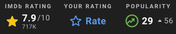

# Exposure

**Serendipity affordance family:** Sensoriability  
**Definition:** Highlighting broader or longer-lasting cues, for example, exposure of book covers.

Exposure concerns the duration and visibility of cues in the information environment. Features mapped here can stimulate serendipity by keeping relevant routes, profiles, covers, or highlighted elements available long enough to be noticed.

## Feature Pathways

| Code | Feature | Category | Page |
| --- | --- | --- | --- |
| U4 | Global navigation | User interface | [features/user-interface/u4-global-navigation.md](../../features/user-interface/u4-global-navigation.md) |
| U8 | Emphasis | User interface | [features/user-interface/u8-emphasis.md](../../features/user-interface/u8-emphasis.md) |
| U9 | Pop-up | User interface | [features/user-interface/u9-pop-up.md](../../features/user-interface/u9-pop-up.md) |
| B4 | User profiles | Information access: browsing | [features/information-access/browsing/b4-user-profiles.md](../../features/information-access/browsing/b4-user-profiles.md) |

## Examples

### U4 Global navigation

### U8 Emphasis

### U9 Pop-up

### B4 User profiles

