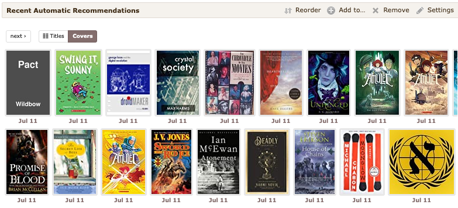
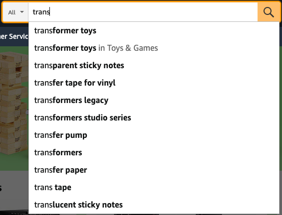

# Accessibility

**Serendipity affordance family:** Traversability  
**Definition:** Access to a specific spot or item, convergently, for example homepage access.

Accessibility concerns whether users can reach particular items, categories, people, or locations in the system. Features mapped here can stimulate serendipity by lowering the effort required to reach potentially interesting material, including items users did not originally know how to ask for.

## Feature Pathways

| Code | Feature | Category | Page |
| --- | --- | --- | --- |
| U4 | Global navigation | User interface | [features/user-interface/u4-global-navigation.md](../../features/user-interface/u4-global-navigation.md) |
| R1 | Personalized recommendation | Information access: recommendation | [features/information-access/recommendation/r1-personalized.md](../../features/information-access/recommendation/r1-personalized.md) |
| R2 | Non-personalized recommendation | Information access: recommendation | [features/information-access/recommendation/r2-non-personalized.md](../../features/information-access/recommendation/r2-non-personalized.md) |
| S1 | Search engine | Information access: search | [features/information-access/search/s1-search-engine.md](../../features/information-access/search/s1-search-engine.md) |
| S2 | Auto-completion | Information access: search | [features/information-access/search/s2-auto-completion.md](../../features/information-access/search/s2-auto-completion.md) |
| B1 | Hyperlinks | Information access: browsing | [features/information-access/browsing/b1-hyperlinks.md](../../features/information-access/browsing/b1-hyperlinks.md) |
| B2 | Breadcrumb trails | Information access: browsing | [features/information-access/browsing/b2-breadcrumb-trails.md](../../features/information-access/browsing/b2-breadcrumb-trails.md) |

## Examples

### U4 Global navigation

### R1 Personalized recommendation

### R2 Non-personalized recommendation

### S1 Search engine

### S2 Auto-completion

### B1 Hyperlinks

### B2 Breadcrumb trails

