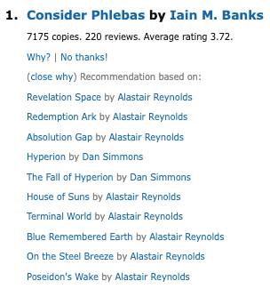
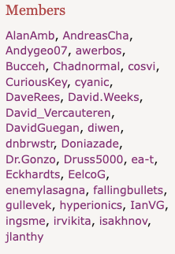

# Explorability

**Serendipity affordance family:** Traversability  
**Definition:** Invitations to go somewhere else or follow a divergent path, for example, non-grid layouts.

Explorability concerns invitations to leave a narrow task path and follow a divergent route. Features mapped here can stimulate serendipity by making detours visible, meaningful, and easy to pursue.

## Feature Pathways

| Code | Feature | Category | Page |
| --- | --- | --- | --- |
| U5 | Presentation structure | User interface | [features/user-interface/u5-presentation-structure.md](../../features/user-interface/u5-presentation-structure.md) |
| U7 | Explanations | User interface | [features/user-interface/u7-explanations.md](../../features/user-interface/u7-explanations.md) |
| R4 | Item-to-item recommendation | Information access: recommendation | [features/information-access/recommendation/r4-item-to-item.md](../../features/information-access/recommendation/r4-item-to-item.md) |
| R5 | User-to-user recommendation | Information access: recommendation | [features/information-access/recommendation/r5-user-to-user.md](../../features/information-access/recommendation/r5-user-to-user.md) |
| S2 | Auto-completion | Information access: search | [features/information-access/search/s2-auto-completion.md](../../features/information-access/search/s2-auto-completion.md) |
| B1 | Hyperlinks | Information access: browsing | [features/information-access/browsing/b1-hyperlinks.md](../../features/information-access/browsing/b1-hyperlinks.md) |

## Examples

### U5 Presentation structure

### U7 Explanations

### R4 Item-to-item recommendation

### R5 User-to-user recommendation

### S2 Auto-completion

### B1 Hyperlinks

