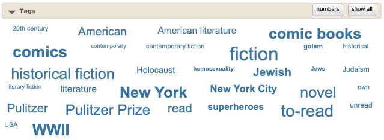
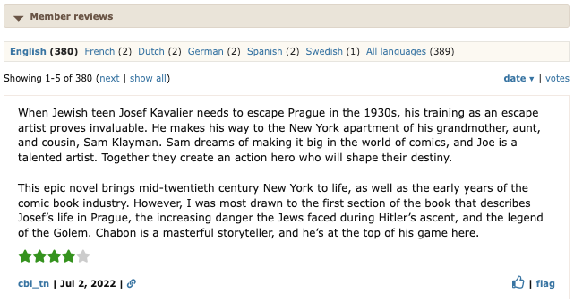
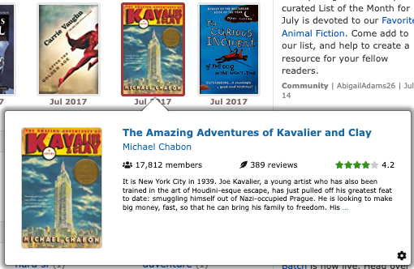
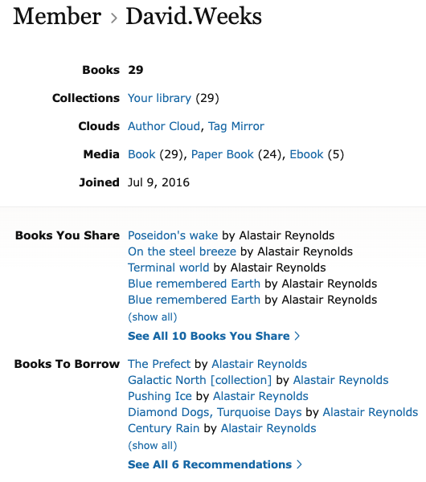
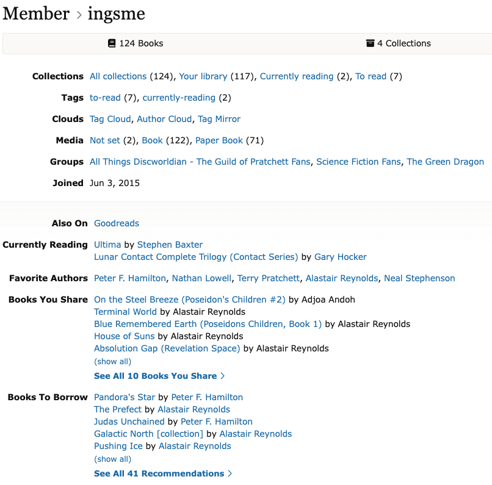

# Slowability

**Serendipity affordance family:** Traversability  
**Definition:** Affording a slower pace of inspection, reflection, or browsing, for example, obstacles or queues.

Slowability concerns interface and access features that encourage users to pause, inspect, read, or reflect. Features mapped here can stimulate serendipity by creating time for users to notice relations and possibilities that quick scanning would miss.

## Feature Pathways

| Code | Feature | Category | Page |
| --- | --- | --- | --- |
| U1 | Metadata | User interface | [features/user-interface/u1-metadata.md](../../features/user-interface/u1-metadata.md) |
| U2 | User-generated content | User interface | [features/user-interface/u2-user-generated-content.md](../../features/user-interface/u2-user-generated-content.md) |
| U9 | Pop-up | User interface | [features/user-interface/u9-pop-up.md](../../features/user-interface/u9-pop-up.md) |
| B2 | Breadcrumb trails | Information access: browsing | [features/information-access/browsing/b2-breadcrumb-trails.md](../../features/information-access/browsing/b2-breadcrumb-trails.md) |
| B3 | Collections | Information access: browsing | [features/information-access/browsing/b3-collections.md](../../features/information-access/browsing/b3-collections.md) |
| B4 | User profiles | Information access: browsing | [features/information-access/browsing/b4-user-profiles.md](../../features/information-access/browsing/b4-user-profiles.md) |

## Examples

### U1 Metadata

### U2 User-generated content

### U9 Pop-up

### B2 Breadcrumb trails

### B3 Collections

### B4 User profiles

