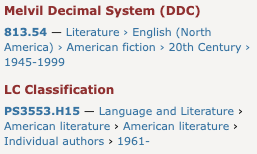

# C2 Controlled Vocabulary

**Category:** Content  
**Affordance mapping:** Diversity, Incompleteness

Controlled vocabularies are taxonomies, thesauri, ontologies, genres, facets, or hierarchical category systems that prescribe the terms used to describe items.

## Why It May Support Serendipity

Controlled vocabularies can widen the apparent diversity of a catalogue by exposing users to broad and specific categories. Broad or ambiguous categories may also leave productive gaps, giving users room to interpret and follow unexpected connections.

## Design Considerations

- Expose both broad categories and narrower terms where the domain supports them.
- Keep category labels stable enough for comparison across items.
- Treat taxonomy depth as a design variable: too shallow may feel vague, too deep may constrain exploration.

## Examples

Related legacy snippet filename:

- `B2-Controlled-vocabulary-01.png`

