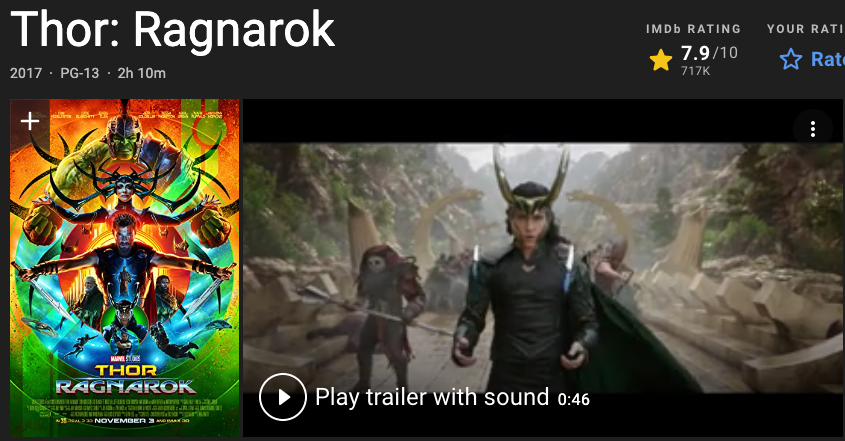

# C4 Multimedia

**Category:** Content  
**Affordance mapping:** Diversity

Multimedia refers to item content represented through text, audio, images, animation, video, previews, trailers, samples, covers, or other media forms.

## Why It May Support Serendipity

Multimedia gives users additional sensory and semantic material to compare. It can make items feel more differentiated than a text-only catalogue and can reveal unexpected relevance through images, excerpts, sound, or motion.

## Design Considerations

- Use media that actually represents the item, not generic decoration.
- Consider whether media is metadata, preview content, or the recommended item itself.
- Provide fallbacks for accessibility and for sparse catalogues.

## Examples

