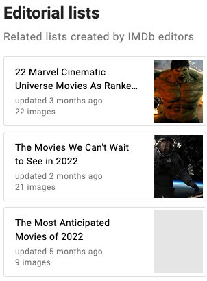

# B3 Collections

**Category:** Information access  
**Subcategory:** Browsing  
**Affordance mapping:** Cross-contacts, Slowability, Pointers

Collections are browsable sets of items grouped by a theme, person, context, editorial purpose, user list, shelf, playlist, or other organizing principle.

## Why It May Support Serendipity

Collections bring items into contact and give users a reason to inspect them together. They can slow browsing into a more reflective mode and point users toward a theme they did not explicitly search for.

## Design Considerations

- Distinguish curated collections, user-created lists, algorithmic collections, and system categories.
- Make the collection's theme or origin visible.
- Consider collections both as recommendation modules and as browsable destinations.

## Examples

