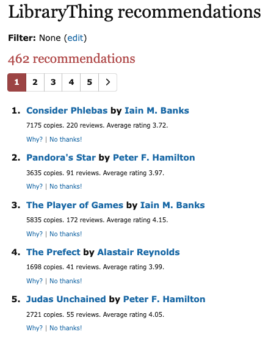

# R1 Personalized Recommendation

**Category:** Information access  
**Subcategory:** Recommendation  
**Affordance mapping:** Accessibility, Pointers

Personalized recommendations use information about an individual user, such as ratings, behavior, preferences, or profile data, to suggest items.

## Why It May Support Serendipity

Personalization can make potentially interesting items more accessible and can point users toward material that fits latent or adjacent interests. Its serendipity value depends on whether it surfaces more than the obvious next item.

## Design Considerations

- Record what evidence supports the personalization claim.
- Compare personalization strategies when possible, for example content-based versus collaborative approaches.
- Watch for over-specialization, where personalization narrows rather than expands discovery.

## Examples

