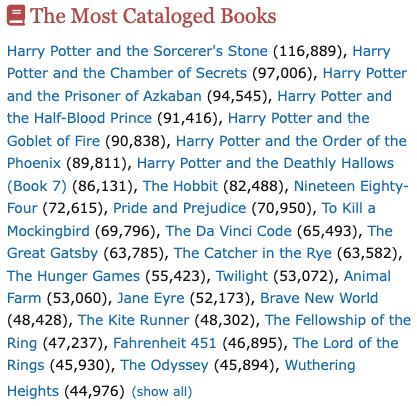

# R2 Non-Personalized Recommendation

**Category:** Information access  
**Subcategory:** Recommendation  
**Affordance mapping:** Cross-contacts, Accessibility, Pointers

Non-personalized recommendations suggest items without adapting to the individual user, for example trending, popular, recent, highly rated, or broadly recommended items.

## Why It May Support Serendipity

Because the list is not constrained by the user's profile, it may create cross-contacts with unfamiliar topics, genres, or communities while still offering a clear route to items.

## Design Considerations

- Label the basis of the list, such as popular, new, top rated, or frequently borrowed.
- Consider whether the list is global, regional, domain-specific, or time-bound.
- Compare with personalized lists to test whether broader exposure improves serendipity.

## Examples

