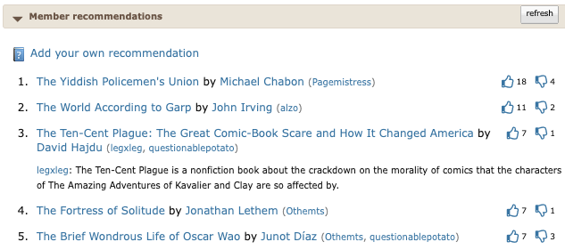
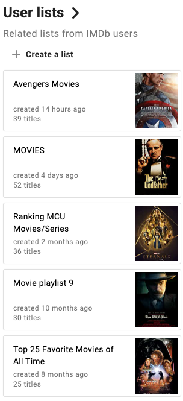

# R3 Curated Recommendation

**Category:** Information access  
**Subcategory:** Recommendation  
**Affordance mapping:** Cross-contacts, Pointers

Curated recommendations are selected or organized by editors, experts, librarians, creators, staff, or other trusted curators rather than generated solely from user behavior.

## Why It May Support Serendipity

Curated lists can deliberately bring items into contact across themes, genres, or contexts. The curator's framing can also act as a pointer that helps users interpret why the items belong together.

## Design Considerations

- Make the curator, editorial logic, or theme visible where possible.
- Preserve curatorial surprise without making the list feel arbitrary.
- Track whether curated modules encourage divergent clicks or saved personal favorites.

## Examples

