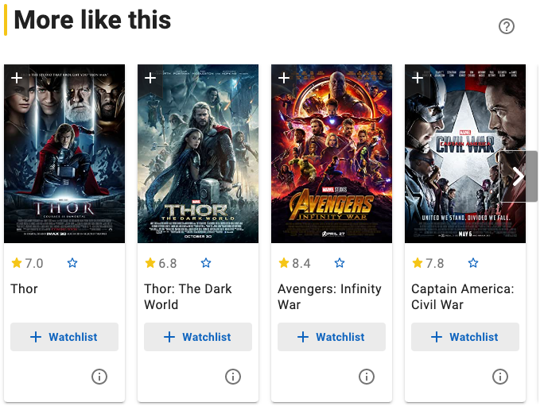
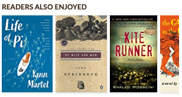

# R4 Item-To-Item Recommendation

**Category:** Information access  
**Subcategory:** Recommendation  
**Affordance mapping:** Cross-contacts, Multi-reachability, Explorability, Pointers

Item-to-item recommendations suggest items related to the item currently being viewed, such as similar items, also bought, also viewed, related works, sequels, or thematic neighbors.

## Why It May Support Serendipity

Item-to-item routes create local paths through a catalogue. They can connect items across metadata, behavior, or editorial relations, inviting users to move from one item to another in a way that may become exploratory.

## Design Considerations

- Identify whether the relation is similarity, co-consumption, sequence, theme, or another link type.
- Make relations navigable from detail pages and, where useful, from compact cards.
- Consider how far users can travel before returning to a search or recommendation overview.

## Examples

