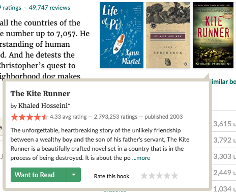

# U9 Pop-Up

**Category:** User interface  
**Affordance mapping:** Slowability, Exposure, Contrast

Pop-ups include overlays, modals, hover cards, tooltips, previews, and other transient interface elements that interrupt or supplement the main view.

## Why It May Support Serendipity

A pop-up can slow users down, increase exposure to a specific item or cue, and create contrast with the surrounding interface. It can reveal extra information without requiring a full page transition.

## Design Considerations

- Use pop-ups to reveal meaningful extra context, not just promotional interruption.
- Keep dismissal and continuation paths clear.
- Treat timing, trigger, size, and content as separate design variables.

## Examples

Related snippet filename preserved from the archive:

- `UX-Popup.png`

